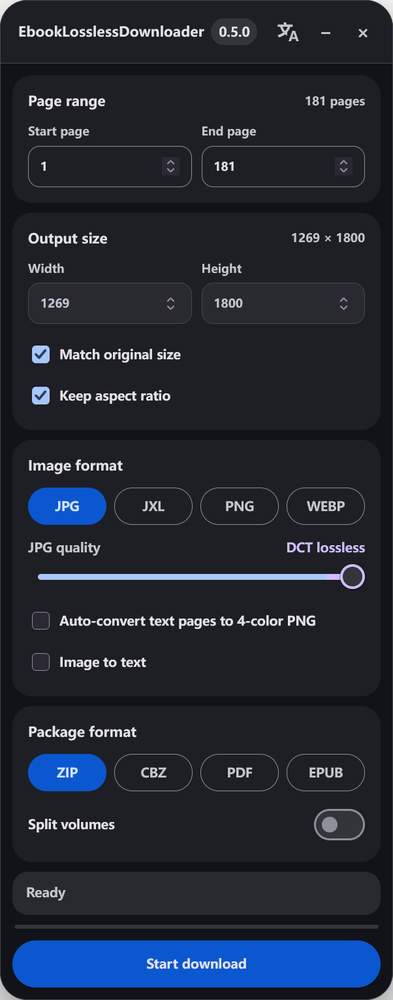

# EbookLosslessDownloader

[English](README.md) | [中文](README.zh-CN.md) | [日本語](README.ja.md)

**EbookLosslessDownloader（电子书无损下载器）** 是一个用户脚本，用于从受支持的平台下载可访问的电子书页面，同时尽可能保留源画质，并支持格式转换、OCR，以及导出为 ZIP、CBZ、PDF 或 EPUB。

- English: EbookLosslessDownloader
- 日本語：電子書籍ロスレスダウンローダー
- 仓库：https://github.com/Li3Zi3han2/EbookLosslessDownloader

> [!IMPORTANT]
> **法律与访问权限免责声明。** 请仅将本脚本用于你有权访问的内容，并遵守适用法律、著作权规则、合同义务以及所使用平台的服务条款。EbookLosslessDownloader 不会赋予当前阅读器会话本来无法访问的内容访问权限，也并非用于绕过 DRM、身份验证、付费墙或其他访问控制措施。你应自行对软件的使用方式以及下载、导出的内容承担责任。本项目不保证某种具体用途在所有司法辖区均合法，本说明亦不构成法律意见。
>
> **项目独立性。** EbookLosslessDownloader 是独立的开源项目，与任何电子书平台或权利方不存在隶属、授权、背书或赞助关系。相关产品名称和商标归各自权利人所有。
>
> **AI 辅助说明。** 本项目的代码开发获得了 **OpenAI 的 ChatGPT** 的协助。项目作者仍对代码的审查、测试、维护和发布负责。

## 截图

<p align="center">
  <a href="assets/interface.png">
    
  </a>
</p>

## 这里的“无损”是什么意思

这里的“无损”是指：相对于平台向阅读器提供的页面数据，尽量**避免额外的、不必要的画质劣化**。它并不表示每一页源文件本身都是原始无损母版。

对于符合条件的 JPG 页面，EbookLosslessDownloader 可以直接重排量化后的 JPG DCT 系数，并重新编码熵数据流，而无需先反量化再重新量化图像，从而避免再产生一代 JPG 有损压缩。源 JPG 本身仍可能已经包含出版社或平台造成的压缩损失。

对于 PNG、无损 WEBP 和无损 JXL 输出，编码结果会保留转换路径中得到的解码像素数据。把已经有损的 JPG 转换成无损格式，并不能恢复 JPG 源文件中本来就不存在的信息。

## 平台支持

| 平台 | 试读 / 预览内容 | 已购买内容 |
| --- | :---: | :---: |
| BOOK☆WALKER JP | ✅ | ✅ |
| GOOGLE PLAY BOOKS | 🚧 | 🚧 |

**✅ 已支持** · **🚧 计划中**

## 功能

- [x] 在可能的情况下直接保留源页面数据，避免不必要的解码—重新编码流程。
- [x] 对符合条件的 JPG 页面执行系数域还原；当 NFBR 块重排可直接在 DCT 域完成时，避免额外的 JPG 量化损失。
- [x] 图片输出：**JPG、JXL、PNG、WEBP**。
- [x] 打包输出：**ZIP**。
- [x] ⚠️ **实验性 / 未经验证：** 打包为 **CBZ、PDF、EPUB**。PDF 使用 JPG 页面图片，支持分卷，并可将 OCR 文字嵌入为文本层。
- [x] ⚠️ **实验性 / 未经验证：** 自动将检测到的文本页转换为 **4 色 PNG**。
- [x] ⚠️ **实验性 / 未经验证：** 使用 **日语 + 英语** 进行 OCR。
- [x] ZIP / CBZ / EPUB 流式写入，降低构建压缩包时的内存占用。
- [x] 可用时优先使用 OPFS 临时存储，并提供 IndexedDB / 内存回退方案；可自动清理异常退出后遗留的过期 OPFS 数据。
- [x] 图片编解码和 JPG 系数处理在 Web Worker 中运行。
- [x] 使用小型 OCR Worker 池，使识别可与页面处理并行执行。
- [x] Material Design 3 界面。
- [x] 界面语言：**中文 / English / 日本語**，并在本地记住用户选择。
- [x] 隐藏式开发者模式，用于诊断信息以及保真 / 耗时元数据。

## 安装和使用

1. 安装 Tampermonkey、Violentmonkey 等用户脚本管理器。
2. 使用下面的 Raw 用户脚本地址安装 `EbookLosslessDownloader.user.js`。通过该地址安装，可让用户脚本管理器记录安装来源并使用脚本中配置的更新地址：

   ```text
   https://raw.githubusercontent.com/Li3Zi3han2/EbookLosslessDownloader/main/EbookLosslessDownloader.user.js
   ```

3. 在网页阅读器中打开受支持的试读 / 预览书籍或已购买书籍，EbookLosslessDownloader 面板会自动出现。
4. 如需切换界面语言，点击最小化按钮左侧的翻译样式按钮，并选择 **中文**、**English** 或 **日本語**。选择结果会保存在本地。
5. 等待面板显示总页数以及 **就绪 / Ready / 準備完了**。
6. 选择起止页、输出尺寸、图片格式和质量参数。
7. 按需开启 4 色文本页转换、OCR 或分卷。
8. 选择 ZIP、CBZ、PDF 或 EPUB，然后开始下载。
9. 如需开启开发者模式，快速连续点击版本号 5 次。开发者模式会额外输出诊断信息、详细耗时信息，并在受支持的压缩包输出中加入 `manifest.json` 保真元数据。开发者模式开启时再次单击版本号即可关闭。

## 输出格式

### 图片

| 格式 | 说明 |
| --- | --- |
| JPG | 文件较小；符合条件时使用 DCT 域保真处理。 |
| JXL | 高效率的现代有损或无损图片输出。 |
| PNG | 无损输出。⚠️ **实验性 / 未经验证：** 可选对检测到的文本页进行 4 色优化。 |
| WEBP | 有损或无损图片输出。 |

### 打包

| 格式 | 说明 |
| --- | --- |
| ZIP | 图片压缩包；图片本身不再进行无意义的 ZIP 二次压缩。 |
| CBZ | ⚠️ **实验性 / 未经验证。** 带有 `ComicInfo.xml` 的漫画 ZIP。 |
| PDF | ⚠️ **实验性 / 未经验证。** 页面图片强制使用 JPG；可将 OCR 文字嵌入为文本层。 |
| EPUB | ⚠️ **实验性 / 未经验证。** 固定版式、以图片为页面主体的 EPUB。 |

所有打包格式均支持可选分卷。

## 存储与网络

页面数据在浏览器本地处理。脚本优先使用浏览器的 Origin Private File System（OPFS）临时保存页面 / 压缩包数据；OPFS 不可用时会回退到 IndexedDB 或内存。正常完成后会删除临时会话数据；异常退出遗留的过期会话 / 压缩包数据会在后续运行时自动清理。

脚本还会访问：

- 当前受支持电子书平台，用于取得当前阅读器会话已经能够访问的页面数据；
- 运行时图片编解码器 / 库所需的固定版本 CDN 资源；
- 启用 OCR 时所需的 OCR 语言与运行时资源。

运行时库会固定到指定版本；对于加载器已经实现校验的资源，还会核对预期 SHA-256 哈希值。

## 运行时组件

当前脚本使用或改编以下开源组件：

| 组件 | 版本 | 协议 |
| --- | ---: | --- |
| jsPDF | 2.5.1 | MIT |
| Tesseract.js | 6.0.1 | Apache-2.0 |
| pako | 2.1.0 | MIT / Zlib |
| @jsquash/webp | 1.5.0 | Apache-2.0 |
| @jsquash/jxl | 1.2.0 | Apache-2.0 |
| @cross/image | 0.4.3 | MIT |

其中 `@cross/image` 的 JPG 代码经过改编 / 打包，用于 JPG 系数域处理。第三方组件仍分别适用其原始许可证与版权声明，详见 `THIRD_PARTY_NOTICES.md`。

## 兼容性

脚本面向当前桌面版 Chromium / Firefox 系浏览器，并要求用户脚本管理器支持 `unsafeWindow` 与 `GM_xmlhttpRequest`。

## 问题反馈

请在以下地址提交可复现的问题：

https://github.com/Li3Zi3han2/EbookLosslessDownloader/issues

建议包含：

- 浏览器及版本；
- 用户脚本管理器及版本；
- 平台，以及书籍属于试读 / 预览还是已购买；
- EbookLosslessDownloader 版本；
- 选择的图片 / 打包参数；
- 必要时提供开发者模式诊断信息。

请勿公开账号凭据、Cookie、带签名的私有 URL 或其他敏感会话数据。

## 开源许可

EbookLosslessDownloader 采用 **GNU General Public License v3.0 or later（GPL-3.0-or-later）** 发布，详见 `LICENSE`。

如果公开分发修改版，需要依照适用的 GPL 条款继续提供相应源码。第三方组件仍保留其各自的许可证和声明，详见 `THIRD_PARTY_NOTICES.md`。

## Star 历史

如果本项目对你有帮助，欢迎点一个 ⭐。

<a href="https://www.star-history.com/?repos=Li3Zi3han2%2FEbookLosslessDownloader&type=date">
  <picture>
    <source
      media="(prefers-color-scheme: dark)"
      srcset="https://api.star-history.com/chart?repos=Li3Zi3han2/EbookLosslessDownloader&type=date&theme=dark"
    />
    <source
      media="(prefers-color-scheme: light)"
      srcset="https://api.star-history.com/chart?repos=Li3Zi3han2/EbookLosslessDownloader&type=date"
    />
    
  </picture>
</a>
